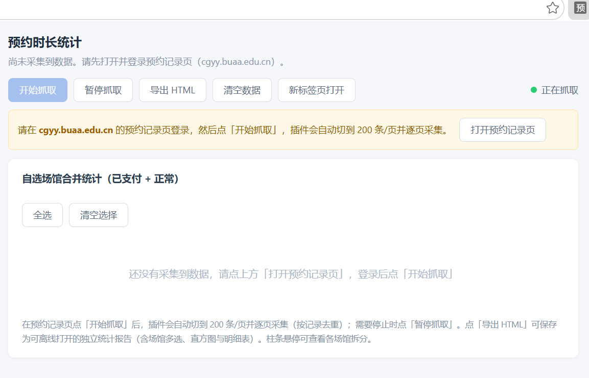

# 预约时长统计（浏览器扩展）

一个用于统计场馆预约时长的浏览器扩展。它在预约记录页面上自动采集表格数据，按场馆合并统计预约时长，并以直方图和明细表展示，还可导出为可离线打开的独立 HTML 报告。

支持 Chrome 与 Microsoft Edge（两者安装方式相同，均已实测通过）。

## 安装方式

本扩展未上架应用商店，使用「加载已解压的扩展程序」方式安装。

Chrome：

1. 下载本仓库（`git clone` 或右上角 Code → Download ZIP 后解压）。
2. 在地址栏打开 `chrome://extensions`。
3. 打开右上角的「开发者模式」。
4. 点击「加载已解压的扩展程序」，选择本项目目录（包含 `manifest.json` 的那个文件夹）。

Microsoft Edge：

1. 下载并解压本仓库。
2. 在地址栏打开 `edge://extensions`。
3. 打开左侧的「开发人员模式」。
4. 点击「加载解压缩的扩展」，选择本项目目录（包含 `manifest.json` 的那个文件夹）。

安装成功后，工具栏会出现「预约时长统计」图标，点击即可打开弹窗。

## 使用步骤

1. 在浏览器中打开并登录预约记录页。
2. 点击扩展图标，在弹窗中点「打开预约记录页」（已打开该页面时会直接切过去）。
3. 点「开始抓取」，插件会自动逐页采集。
4. 采集完成后查看统计结果；需要中途停止时点「暂停抓取」。

> 提示：Chrome/Edge 的扩展小弹窗在切换到其他标签页时会自动关闭。如果想在采集过程中实时看到进度与结果，请在弹窗中点「新标签页打开」，在独立标签页中操作。

## 界面说明



| 按钮 | 作用 |
| --- | --- |
| 开始抓取 | 开始自动采集，自动翻页直到最后一页 |
| 暂停抓取 | 立即停止采集与自动翻页 |
| 导出 HTML | 导出可离线打开的独立统计报告 |
| 清空数据 | 清空已采集的数据（需连续点击两次确认） |
| 新标签页打开 | 在独立标签页中打开统计界面，可随窗口缩放 |
| 打开预约记录页 | 打开（或切换到）预约记录页 |
| 全选 / 清空选择 | 快速选中或取消全部场馆 |

直方图与明细表会随着所选场馆即时更新；柱条悬停可查看该月的场馆拆分。

## 数据与隐私

- 所有数据仅保存在浏览器本地存储中，不会发送到任何服务器。
- 扩展申请的权限：
  - `storage`：保存采集到的记录与开关状态。
  - 目标预约站点域名：仅在该站点注入采集脚本。
- 「清空数据」会删除全部已采集记录。

## 目录结构

```
extension/
├── manifest.json    # 扩展清单（Manifest V3）
├── background.js    # 后台脚本：更新图标角标上的记录数
├── content.js       # 内容脚本：解析表格、自动翻页、去重合并
├── popup.html       # 弹窗界面结构
└── popup.js         # 弹窗逻辑：统计、渲染图表、导出 HTML
```

## 兼容性与说明

- 仅适配 `manifest.json` 中配置的目标预约站点（`host_permissions` / `content_scripts.matches`）。
- 自动翻页依赖目标站点使用的 iView 组件 DOM 结构（如分页 `li.ivu-page-next`、每页条数下拉 `.ivu-select-item` 等）；若站点改版，相关选择器可能需要同步调整。
- 采用的是 Manifest V3，适用于较新版本的 Chrome / Edge。
